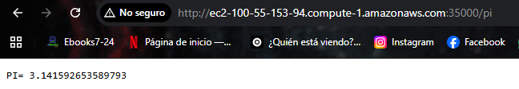
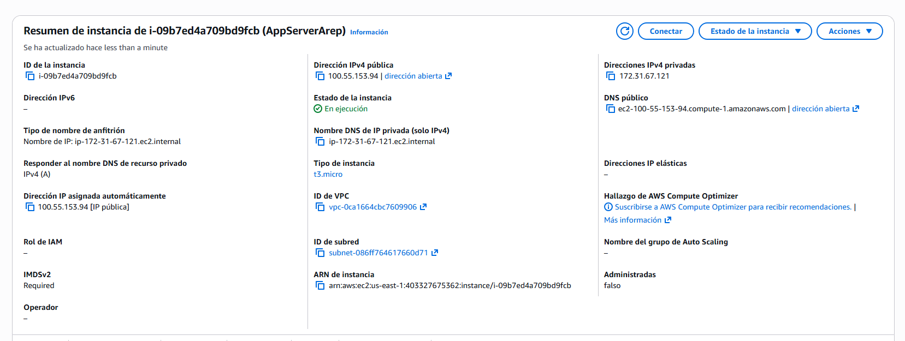

# MicroSpringBootG

MicroSpringBootG is a lightweight Java HTTP server and reflection-based IoC micro-framework that supports static resources (`HTML` and `PNG`) and dynamic endpoint discovery using custom annotations (`@RestController`, `@GetMapping`, and `@RequestParam`). The project demonstrates core concepts of annotation processing, classpath scanning, and simple web request handling without relying on Spring MVC.


## Getting Started

These instructions will get you a copy of the project up and running on your local machine for development and testing purposes. See `Deployment` for notes on how to deploy this project on a live AWS EC2 environment.

## Prerequisites

What things you need to install the software and how to install them.

- Java 17 (JDK)
- Maven 3.9+ (or Maven Wrapper via `mvnw` / `mvnw.cmd`)
- Git (optional, for cloning)

Give examples.

```bash
java -version
mvn -version
```

## Installing

A step by step series of examples that tell you how to get a development environment running.

Say what the step will be.

1. Clone the repository.

Give the example.

```bash
git clone <your-repository-url>
cd MicroSpringBoot
```

And repeat.

2. Build the project.

```bash
# Linux / macOS
./mvnw clean package -DskipTests

# Windows
mvnw.cmd clean package -DskipTests
```

3. Run the server.

```bash
java -cp target/classes co.edu.escuelaing.microspringbootg.MicroSpringBootG
```

until finished.

4. Open the app in your browser.

```text
http://localhost:35000/
```

End with an example of getting some data out of the system or using it for a little demo.

```bash
curl http://localhost:35000/pi
curl "http://localhost:35000/greeting?name=Ana"
```

Expected sample output:

- `/pi` -> `PI= 3.141592653589793`
- `/greeting?name=Ana` -> `Hola Ana`

### Runtime Options

- `--port=<number>`: set server port (default `35000`)
- `--scan=<base.package>`: set classpath scanning root package (default `co.edu.escuelaing`)

Example:

```bash
java -cp target/classes co.edu.escuelaing.microspringbootg.MicroSpringBootG --port=8080 --scan=co.edu.escuelaing
```

### Legacy Mode (Manual POJO Invocation)

```bash
java -cp target/classes co.edu.escuelaing.microspringbootg.MicroSpringBootG co.edu.escuelaing.microspringbootg.HelloController /pi
```

## Running the tests

Explain how to run the automated tests for this system.

```bash
mvn test
```

Note: this project currently does not include a complete automated test suite. The command is provided as the standard Maven entrypoint and to support future test integration.

### Break down into end to end tests

Explain what these tests test and why.

End-to-end validation verifies the full HTTP request flow: route discovery, annotation handling, query parameter extraction, response rendering, and static file serving.

Give an example.

```bash
curl -i http://localhost:35000/
curl -i http://localhost:35000/logo.png
curl -i "http://localhost:35000/greeting?name=World"
```

### And coding style tests

Explain what these tests test and why.

Style and static analysis checks ensure consistency, maintainability, and early detection of common code smells in reflective and networking code.

Give an example.

```bash
mvn -DskipTests=false verify
```

## Deployment

Add additional notes about how to deploy this on a live system.

### AWS EC2 deployment notes

1. Build the project on the EC2 instance:

```bash
./mvnw clean package -DskipTests
```

2. Start the server (background):

```bash
nohup java -cp target/classes co.edu.escuelaing.microspringbootg.MicroSpringBootG --port=35000 > app.log 2>&1 &
```

3. Open EC2 Security Group inbound rule for TCP `35000`.
4. Access from browser:

```text
http://<EC2_PUBLIC_IP>:35000/
```

5. Stop the service if needed:

```bash
pkill -f co.edu.escuelaing.microspringbootg.MicroSpringBootG
```

## Built With

- Java 17 - Core language and runtime
- Maven - Dependency management and build lifecycle
- Java Reflection API - Annotation scanning and method invocation
- Java Sockets (`ServerSocket` / `Socket`) - HTTP server implementation

## Project Evidence

These images are execution evidence showing that the app runs correctly inside the AWS EC2 instance.

1. Build successful on EC2 instance


2. App running on EC2


3. App running on port 35000 (`/greeting?name=ana`)


4. `/` endpoint response: Greetings from SpringBoot


5. Static resource proof (`/logo.png`)


6. `/pi` endpoint response



7. EC2 instance details


